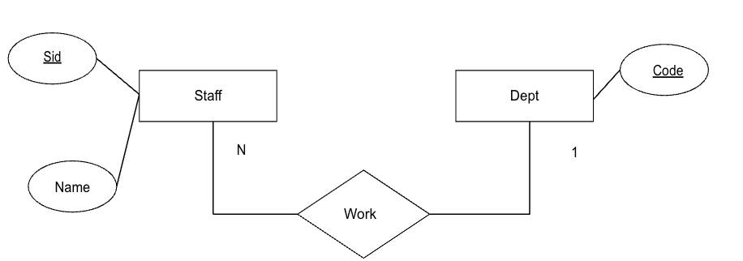

# Cohort Exercise - Express.js, MongoDB, MySQL and Database design

Submit a zip file containing 2 folders for each question.

Task 1 folder contains a project folder. You can use ce5_q1 we provide.

Task 2 folder contains 1 PDF file containing you step-by-step explanation max 2 page

## Task 1 (5 marks)

Given the ER diagram below (refer to lecture note),



implement a simple API web-app with the following end-points using MongoDB database:

1. add dept
   ```url
   http://localhost:3000/dept/add/hr
   ```
   yields
   ```json
   { "code": "hr", "_id": "6478a5a866394647f94f4021" }
   ```
1. add staff
   ```url
   http://localhost:3000/staff/add/1/aaron/hr
   ```
   yields
   ```json
   {
     "id": "1",
     "name": "aaron",
     "dept": "hr",
     "_id": "6478a6de67e208e3a7764c43"
   }
   ```
1. find all deptartments
   ```url
   http://localhost:3000/dept/all/
   ```
   yields
   ```json
   [{ "code": "hr" }]
   ```
1. find all staffs
   ```url
   http://localhost:3000/staff/all/
   ```
   yields
   ```json
   [{ "id": "1", "name": "aaron", "dept": "hr" }]
   ```
1. find all depts with staffs
   ```url
   http://localhost:3000/dept/all/withstaff/
   ```
   yields
   ```json
   [{ "code": "hr", "staffs": [{ "id": "1", "name": "aaron", "dept": "hr" }] }]
   ```

Make sure the database name is `echo` by having the following definition `const dbName = "echo";` in `db.js`.

## Task 2 (5 marks)

Given the ER diagram below,


give the step-by-step explanation on how we can implement the following API which returns the count of staff from each department by using MySQL database:

`http://127.0.0.1:3000/dept/count` 

yields

`[{"count":2,"dept":"HR"}]`.
