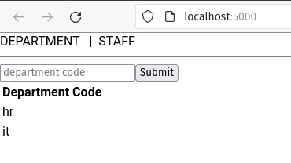
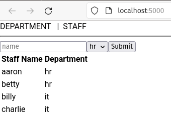

# Cohort Exercise - Frontend Development 

## Learning Outcomes 

## Total 10 Marks

You may submit your codes in a zip file with folders and subfolders, and a report to explain your codes. 

## Question 1 (5 Marks)

### Setup 
1. Extract the given project `ce8_q1`, in a folder. Run `npm i` to download all the dependencies.
1. Install mysql (version >=8)
1. In mysql shell
    1. Create a database named `ce8q1`
    1. Create a non root user with a secure password
1. Modify `models/db.js` according to your newly created user.
1. Examine `models/dept.js`, `models/staff.js` and `models/work.js`. You don't need to modify any of these files.
1. Examine `routes/dept.js` and `routes/staff.js`, You don't need to modify any of these files. 
1. Examine `app.js`. You don't need ot modify it.
1. Examine `views/dept.ejs` and `views/staff.ejs`. You don't need to modify any of these files.

### Task 1 (2 Marks)

Complete the TODOs in the client side JavaScript `public/javascripts/deptajaxclient.js` so that 
the user can use the form in `https://localhost:3000/dept/` to add new department and view the list of existing departments.

### Task 2 (3 Marks)

Complete the TODOS in the client side JavaScript `public/javascripts/staffajaxclient.js` so that 
the user can use the form in `https://localhost:3000/staff/` to add new staff and view the list of existing staffs.

## Question 2 (5 Marks)

#### Setup

1. Reuse the express web app from question1, keep it running at port 3000. 
1. Add the necessary code in the respect end-points to allow access from `localhost:50000`.
1. Extract the given project `ce8_q2`, in a folder. Run `npm i` to download all the dependencies.
1. Start the app with `npm start`
### Task 1 (2 Marks)
Complete the TODOs in the React component `Dept.js` so that the department table can be rendered.

### Task 2 (3 Marks)
Complete the TODOs in the React component `Staff.js` so that the deptartment code drop download can be rendered on start.

